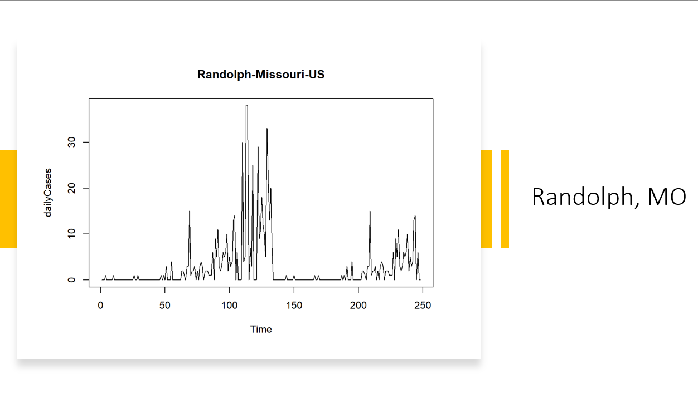
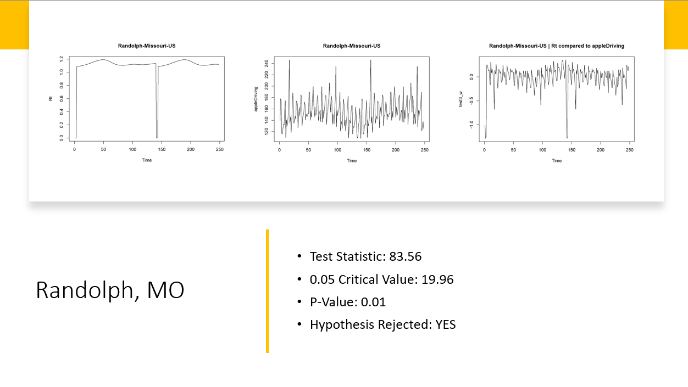
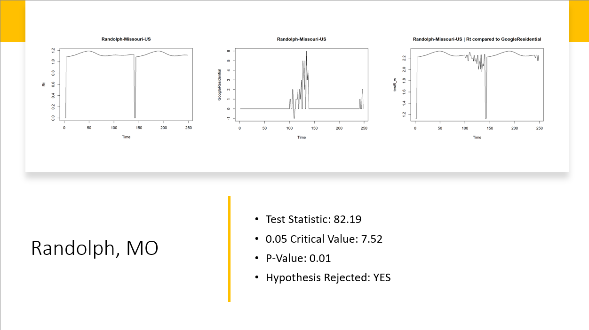
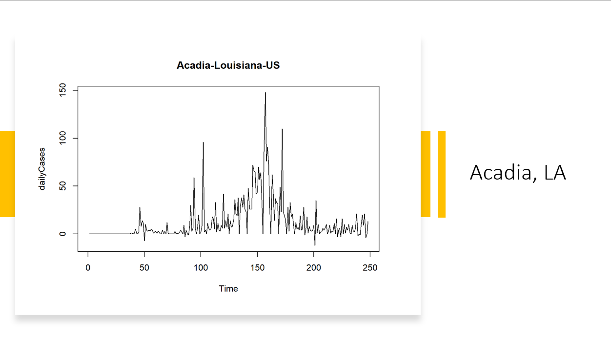
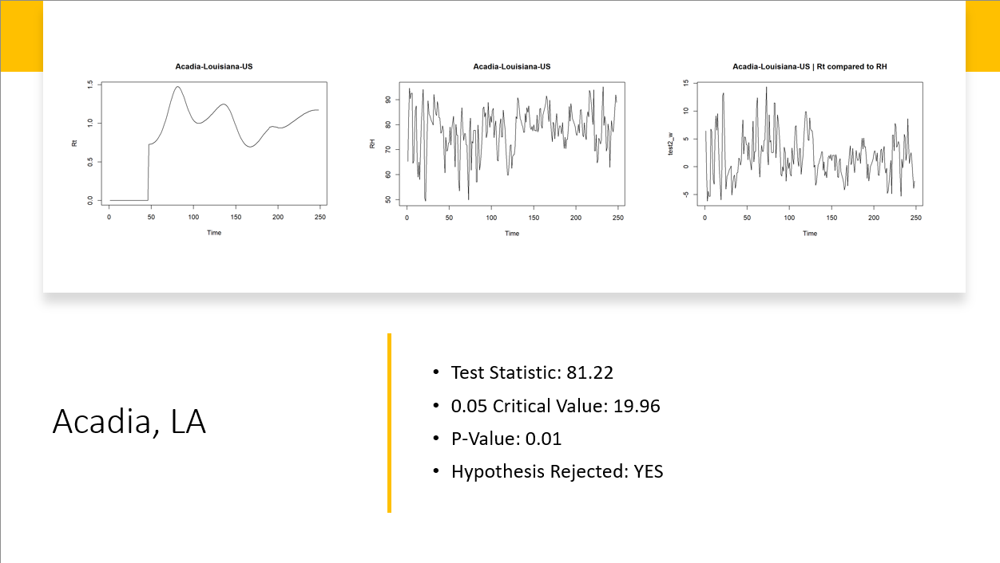
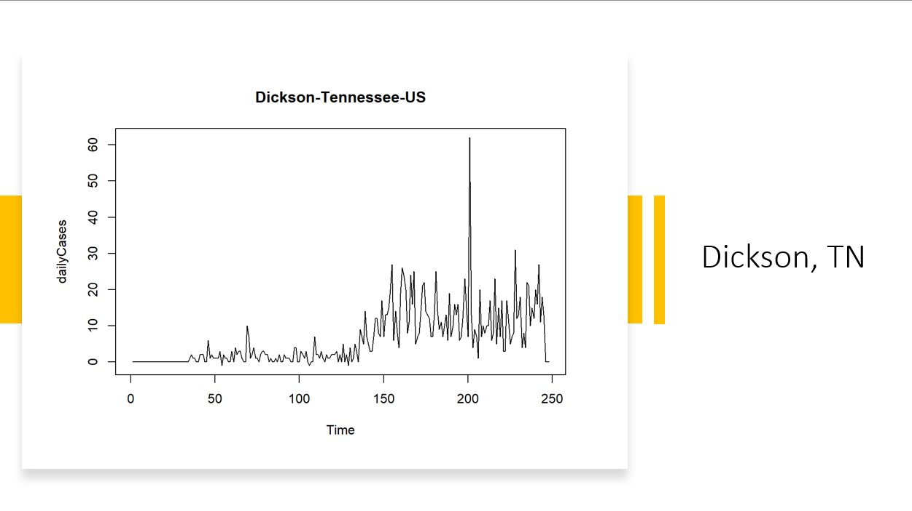
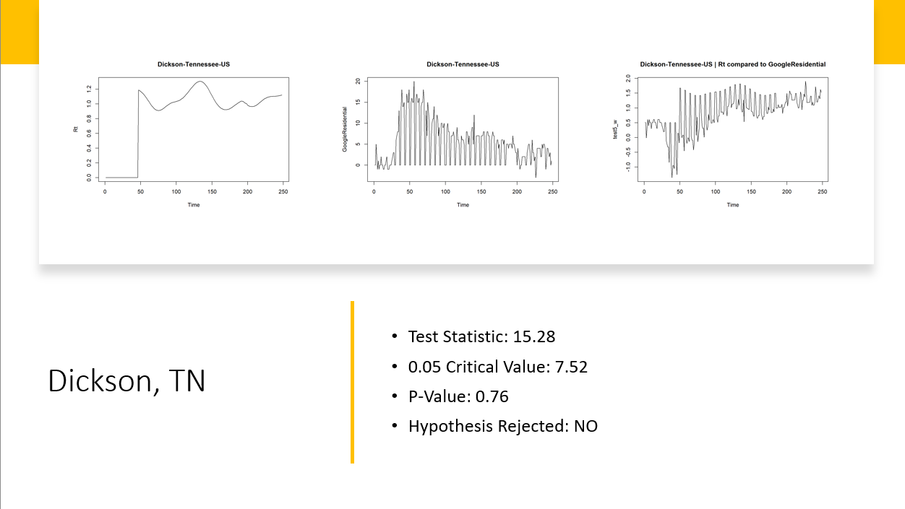

# COVID19-Cointegration
## Project Description

Co-integration analysis is a method for time series analysis that can identify associations among non-stationary variables.  Here, we applied co-integration on the COVID19 transmission and deaths at county levels in the USA, mobility estimations, weather conditions, and social sentiments. Future work will be to identify counties with holiday peaks versus those without detectable holiday peaks and identify potential contributing factors via Twitter Sentiment Data.[^1]
[^1]: Note: This code is belongs to Qin Lab as a part of the iCompBio NSF-REU and is provided for reference only. You may not republish any of this code, make modifications to the code, etc.

## Cointegrated Counties:
### Randolph, MO

### Acadia, LA

## Non-Cointegrated Counties
### Dickson, TN

## Dataset
[County3RWM](https://github.com/torrwill/COVID19-Cointegration/tree/main/county3RWM) contains CSVs of all counties in the US. The data is processed and contains values related to COVID-19 spread, mobility estimates, weather conditions, and social sentiments[^2].
[^2]: The data was aggregated from Johns Hopkins University COVID Dashboard, WHO, NOAA, and the CDC.

